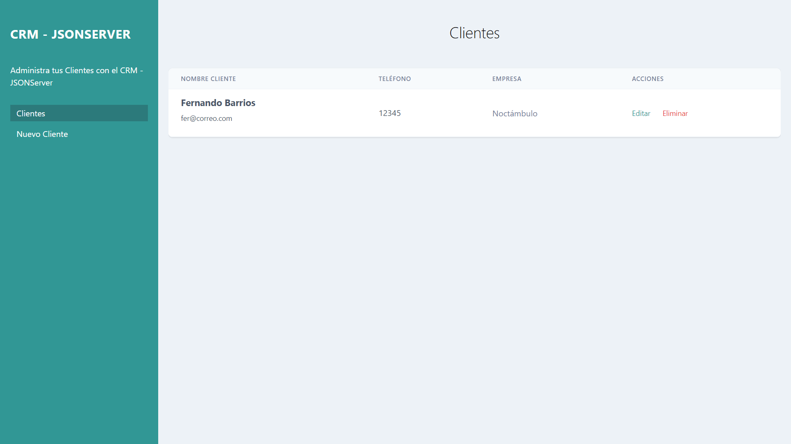
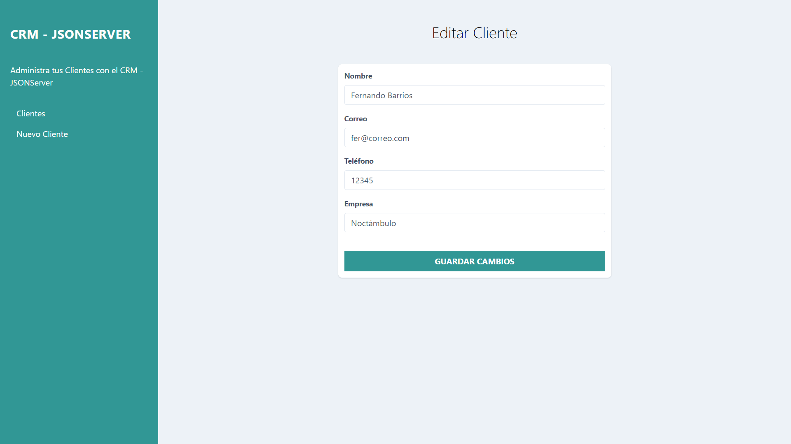

# API-REST
Proyecto de creación y consumo de una API REST

* Ver en línea:
https://fernandolba.github.io/API-REST/index.html

# RECURSOS:
- HTML5
- CSS3 
- JavaScript
- Json-server (Este servidor público no permite guardar cambios)
- Tailwind

* Nota: La pueden probar instalando json-server y desplegándolo desde npm.